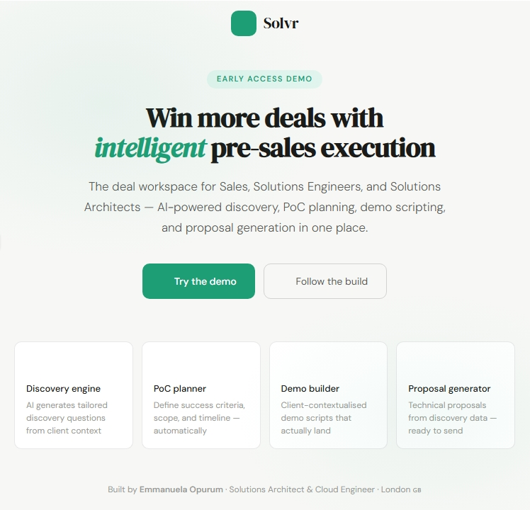

# Solvr: AI-Powered Deal Execution Platform for SA & SE Teams

Pre-sales cycles don't fall apart because of bad products. They fall apart because discovery is ad hoc, demos are generic, and Sales, SE, and SA are never truly aligned.

Solvr is an AI-powered workspace that guides Sales, Solutions Engineers, and Solutions Architects through every stage of the pre-sales motion, from first discovery call to signed proposal.

Live demo: https://solvr-app.netlify.app

## The Problem
Most pre-sales teams face the same friction every deal:

Discovery questions made up on the spot
Demos built for the last client, not this one
The SA doesn't know what the SE promised
The proposal lands generic and unconvincing

Everyone works hard. Nobody works from the same page.

## What Solvr Does
You enter information about your client, their industry, company size, tech stack, and the business challenges they're trying to solve.
Solvr uses Claude AI (Anthropic) to analyse that client data and generate four things that help your team win the deal:

Module                      What it generates 
Discovery engine            6 tailored discovery questions specific to this client's industry, pain, and tech stack 
PoC / PoV planner           Structured PoC brief with scope, measurable success criteria, 4-week timeline, and roles 
Demo builder                Client-contextualised demo script with "wow moments" tied to their exact pain 
Proposal generator          Ready-to-send technical proposal specific to their industry challenges and ROI

Every output is tailored to the specific client — not a template. The AI reads the client's pain, industry, and tech context and writes accordingly.

## Why It Works
Clients don't buy products. They buy solutions to their specific problems.
When an SA, SE, and Sales team walks into a meeting with outputs that speak directly to the client's pain, their industry, their constraints, their goals, it shows the client you understand their business as well as they do. That builds trust. Trust closes deals.

## Tech Stack

Frontend: Vanilla HTML, CSS, JavaScript, no framework, no build step
AI: Google Gemini 2.0 Flash API (browser-native, no backend required)
Hosting: Netlify (free tier)
Design: DM Sans and DM Serif Display, Tabler Icons

## app

.

## Getting Started
Run locally
bashgit clone https://github.com/Cloud-Architect-Emma/solvr.git
cd solvr
open index.html
No install. No build. Just open in a browser.
Use your own API key

Get a free Gemini API key at aistudio.google.com
Open index.html
Replace the GEMINI_API_KEY value near the bottom of the file
Save and open

## Roadmap

 CRM integration (Salesforce, HubSpot)
 Deal health scoring with AI
 Playbook library — reuse winning deal patterns
 Multi-deal workspace
 Team collaboration & activity feed
 Win/loss intelligence layer

## Contributing
PRs welcome. If you work in pre-sales, SA, or SE, I especially want your feedback on what's missing or wrong. Open an issue or reach out directly.

** Built By **
Emmanuela Opurum: Solutions Architect & Cloud Engineer, London 🇬🇧
Building AI-native cloud tooling and contributing to open source in the CNCF ecosystem.

LinkedIn:www.linkedin.com/in/cloud-architect-emma
GitHub:https://github.com/Cloud-Architect-Emma

** License **
MIT: use it, fork it, build on it.
